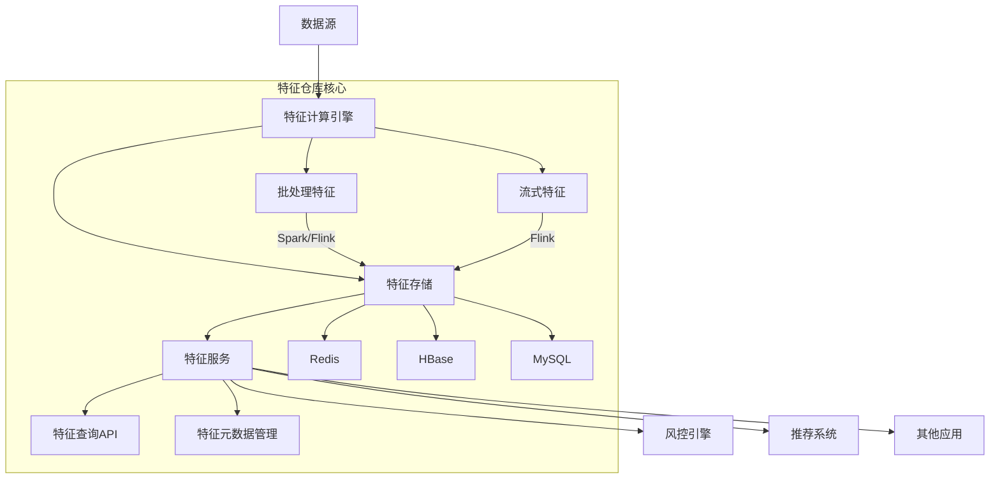
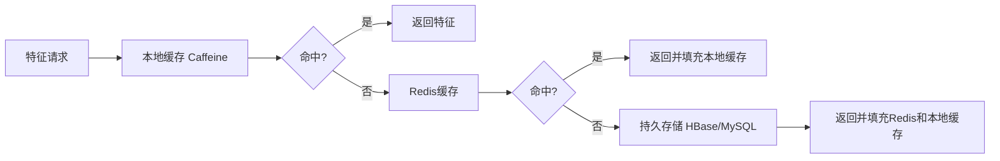
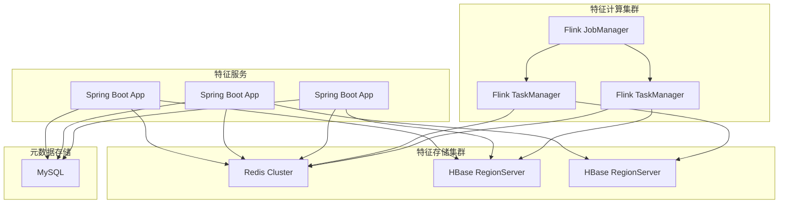

# Spring Boot 特征仓库设计与实现

## 一、系统架构设计



## 二、技术栈选择

| 组件           | 技术选型                | 说明                             |
| -------------- | ----------------------- | -------------------------------- |
| **核心框架**   | Spring Boot 3.x         | 微服务基础框架                   |
| **特征计算**   | Flink 1.17+             | 实时特征计算                     |
| **特征存储**   | Redis 7.x + HBase 2.x   | Redis存高频特征，HBase存历史特征 |
| **元数据管理** | MySQL 8.x               | 特征定义、版本管理               |
| **服务通信**   | gRPC                    | 高性能特征查询接口               |
| **监控**       | Micrometer + Prometheus | 特征服务监控                     |
| **缓存**       | Caffeine                | 本地缓存优化                     |

## 三、核心模块实现

### 1. 特征元数据管理

**实体类设计：**

```java
@Entity
@Table(name = "feature_metadata")
public class FeatureMetadata {
    @Id
    @GeneratedValue(strategy = GenerationType.IDENTITY)
    private Long id;
    
    @Column(nullable = false, unique = true)
    private String name; // user_7d_trans_cnt
    
    @Enumerated(EnumType.STRING)
    private FeatureType type; // NUMERIC, CATEGORICAL, VECTOR
    
    @Enumerated(EnumType.STRING)
    private UpdateFrequency updateFreq; // REALTIME, DAILY, HOURLY
    
    @Enumerated(EnumType.STRING)
    private StorageType storageType; // REDIS, HBASE, MYSQL
    
    private String storagePath; // Redis key前缀或HBase表名
    
    private String description;
    
    private int ttlDays; // 特征有效期
    
    @Version
    private int version; // 乐观锁版本
}
```

### 2. 特征服务实现

**特征查询接口：**
```java
@Service
public class FeatureServiceImpl implements FeatureService {
    
    @Autowired
    private FeatureMetadataRepository metaRepo;
    
    @Autowired
    private RedisTemplate<String, Object> redisTemplate;
    
    @Autowired
    private HBaseTemplate hBaseTemplate;
    
    @Autowired
    private FeatureCache featureCache;
    
    @Override
    @Cacheable(value = "features", key = "#entityKey + ':' + #featureName")
    public Object getFeature(String featureName, String entityKey) {
        // 1. 获取特征元数据
        FeatureMetadata meta = metaRepo.findByName(featureName)
                .orElseThrow(() -> new FeatureNotFoundException(featureName));
        
        // 2. 根据存储类型获取特征
        switch (meta.getStorageType()) {
            case REDIS:
                return getFromRedis(meta, entityKey);
            case HBASE:
                return getFromHBase(meta, entityKey);
            case MYSQL:
                return getFromMySQL(meta, entityKey);
            default:
                throw new UnsupportedOperationException();
        }
    }
    
    private Object getFromRedis(FeatureMetadata meta, String entityKey) {
        String redisKey = buildRedisKey(meta, entityKey);
        return redisTemplate.opsForValue().get(redisKey);
    }
    
    private Object getFromHBase(FeatureMetadata meta, String entityKey) {
        Get get = new Get(Bytes.toBytes(entityKey));
        get.addColumn(Bytes.toBytes("f"), Bytes.toBytes(meta.getName()));
        
        Result result = hBaseTemplate.get(meta.getStoragePath(), get);
        if (result.isEmpty()) return null;
        
        byte[] value = result.getValue(Bytes.toBytes("f"), Bytes.toBytes(meta.getName()));
        return deserializeValue(meta.getType(), value);
    }
    
    private String buildRedisKey(FeatureMetadata meta, String entityKey) {
        return meta.getStoragePath() + ":" + entityKey;
    }
}
```

### 3. 特征计算管道（Flink实现）

```java
public class RealtimeFeatureJob {
    
    public static void main(String[] args) throws Exception {
        StreamExecutionEnvironment env = StreamExecutionEnvironment.getExecutionEnvironment();
        
        // 1. 从Kafka读取交易数据
        DataStream<TransactionEvent> transactions = env
            .addSource(new FlinkKafkaConsumer<>("transactions", 
                new JSONDeserializer<>(TransactionEvent.class), 
                props));
        
        // 2. 计算用户7天交易次数
        DataStream<UserFeature> userFeatures = transactions
            .keyBy(TransactionEvent::getUserId)
            .window(TumblingEventTimeWindows.of(Time.days(7)))
            .aggregate(new TransactionCountAggregator());
        
        // 3. 写入特征存储
        userFeatures.addSink(new FeatureSink());
        
        env.execute("Realtime Feature Calculation");
    }
    
    private static class TransactionCountAggregator 
        implements AggregateFunction<TransactionEvent, Long, Long> {
        
        @Override
        public Long createAccumulator() {
            return 0L;
        }
        
        @Override
        public Long add(TransactionEvent event, Long accumulator) {
            return accumulator + 1;
        }
        
        @Override
        public Long getResult(Long accumulator) {
            return accumulator;
        }
        
        @Override
        public Long merge(Long a, Long b) {
            return a + b;
        }
    }
}

// 特征存储Sink
public class FeatureSink extends RichSinkFunction<UserFeature> {
    
    private transient FeatureService featureService;
    
    @Override
    public void open(Configuration parameters) {
        // 通过Spring上下文获取FeatureService
        featureService = SpringContextUtils.getBean(FeatureService.class);
    }
    
    @Override
    public void invoke(UserFeature feature, Context context) {
        // 更新特征仓库
        featureService.updateFeature(
            "user_7d_trans_cnt", 
            feature.getUserId(), 
            feature.getCount()
        );
    }
}
```

### 4. 特征缓存优化

```java
@Configuration
@EnableCaching
public class CacheConfig {
    
    @Bean
    public CacheManager cacheManager() {
        CaffeineCacheManager cacheManager = new CaffeineCacheManager();
        cacheManager.setCaffeine(Caffeine.newBuilder()
            .expireAfterWrite(5, TimeUnit.MINUTES) // 5分钟缓存
            .maximumSize(10_000) // 最大缓存条目
            .recordStats());
        return cacheManager;
    }
}

// 特征缓存服务
@Service
public class FeatureCache {
    
    @Cacheable(value = "features", key = "#entityKey + ':' + #featureName")
    public Object getFeature(String featureName, String entityKey) {
        // 实际获取特征的方法
    }
    
    @CacheEvict(value = "features", key = "#entityKey + ':' + #featureName")
    public void evictFeature(String featureName, String entityKey) {
        // 缓存失效方法
    }
}
```

## 四、性能优化策略

### 1. 多级缓存架构



### 2. 批量特征获取

```java
public Map<String, Object> batchGetFeatures(
    List<String> featureNames, 
    String entityKey) {
    
    // 1. 分组不同存储类型的特征
    Map<StorageType, List<String>> groupedFeatures = featureNames.stream()
        .collect(Collectors.groupingBy(featureName -> 
            metaRepo.findByName(featureName)
                   .map(FeatureMetadata::getStorageType)
                   .orElse(StorageType.UNKNOWN)));
    
    // 2. 并行获取不同存储的特征
    Map<String, Object> results = new ConcurrentHashMap<>();
    
    groupedFeatures.forEach((storageType, names) -> {
        switch (storageType) {
            case REDIS:
                results.putAll(batchGetFromRedis(names, entityKey));
                break;
            case HBASE:
                results.putAll(batchGetFromHBase(names, entityKey));
                break;
            // 其他存储类型...
        }
    });
    
    return results;
}

private Map<String, Object> batchGetFromRedis(
    List<String> featureNames, 
    String entityKey) {
    
    // 使用Redis Pipeline批量获取
    return redisTemplate.executePipelined((RedisCallback<Object>) connection -> {
        for (String featureName : featureNames) {
            String key = buildRedisKey(featureName, entityKey);
            connection.stringCommands().get(key.getBytes());
        }
        return null;
    }).stream()
      .collect(Collectors.toMap(
          featureNames::get, 
          value -> value,
          (v1, v2) -> v1));
}
```

### 3. 特征分区存储

```java
// 基于实体ID的分区策略
public String buildRedisKey(FeatureMetadata meta, String entityKey) {
    // 对实体ID进行哈希分区 (0-99)
    int partition = Math.abs(entityKey.hashCode()) % 100;
    return String.format("%s:%d:%s", 
        meta.getStoragePath(), partition, entityKey);
}
```

## 五、生产环境增强功能

### 1. 特征版本管理

```java
public Object getFeatureWithVersion(
    String featureName, 
    String entityKey, 
    int version) {
    
    FeatureMetadata meta = metaRepo.findByNameAndVersion(featureName, version)
        .orElseThrow(() -> new FeatureNotFoundException(featureName));
    
    // 根据特定版本获取特征...
}
```

### 2. 特征血缘追踪

```java
@Entity
public class FeatureLineage {
    @Id
    private Long id;
    
    private String featureName;
    
    @ElementCollection
    @CollectionTable(name = "feature_sources")
    private Set<String> sourceTables; // 数据源表
    
    @ElementCollection
    @CollectionTable(name = "feature_dependencies")
    private Set<String> parentFeatures; // 依赖的父特征
    
    private String transformationLogic; // 转换逻辑描述
}
```

### 3. 特征监控

```java
@Aspect
@Component
public class FeatureMonitoringAspect {
    
    private final MeterRegistry meterRegistry;
    
    public FeatureMonitoringAspect(MeterRegistry meterRegistry) {
        this.meterRegistry = meterRegistry;
    }
    
    @Around("execution(* com.example.feature.service.FeatureService.getFeature(..))")
    public Object monitorFeatureAccess(ProceedingJoinPoint pjp) throws Throwable {
        String featureName = (String) pjp.getArgs()[0];
        Timer.Sample sample = Timer.start(meterRegistry);
        
        try {
            return pjp.proceed();
        } finally {
            sample.stop(meterRegistry.timer("feature.access.time", 
                "feature", featureName));
            
            meterRegistry.counter("feature.access.count", 
                "feature", featureName).increment();
        }
    }
}
```

## 六、部署架构



## 七、最佳实践建议

1. **特征命名规范**
   - 使用`{entity}_{time_window}_{metric}`格式
   - 示例: `user_7d_trans_cnt`, `merchant_30d_avg_amount`

2. **特征存储选择策略**
   ```mermaid
   graph TD
       A[特征类型] --> B{更新频率}
       B -->|高频实时| C[Redis]
       B -->|中频| D[HBase]
       B -->|低频| E[MySQL]
       A --> F{数据量}
       F -->|大| D
       F -->|小| C
   ```

3. **特征服务灰度发布**
   
   ```yaml
   feature:
     release:
       strategy: canary
       rules:
         - name: user_region
           targetGroups: 
             - userId: [10000-20000]
             - region: ["North"]
         - name: payment_risk
           targetGroups:
             - merchantType: ["high_risk"]
```
   
4. **特征数据质量监控**
   - 缺失率报警：`missing_rate > 5%`
   - 值域校验：`value < 0` 或超出合理范围
   - 分布变化检测：KL散度监控

## 总结

Spring Boot特征仓库实现的关键要点：

1. **分层架构**：清晰的元数据、存储、计算、服务分层
2. **多存储适配**：根据特征特性选择合适的存储引擎
3. **实时+批量处理**：Flink处理实时特征，Spark处理批量特征
4. **性能优化**：多级缓存、批量获取、分区存储
5. **生产增强**：版本控制、血缘追踪、监控报警

通过此设计，可以构建一个高性能、可扩展的特征仓库，满足风控、推荐等场景对特征数据的实时访问需求。实际部署时，建议结合具体业务场景调整存储策略和计算逻辑，并持续优化特征查询性能。