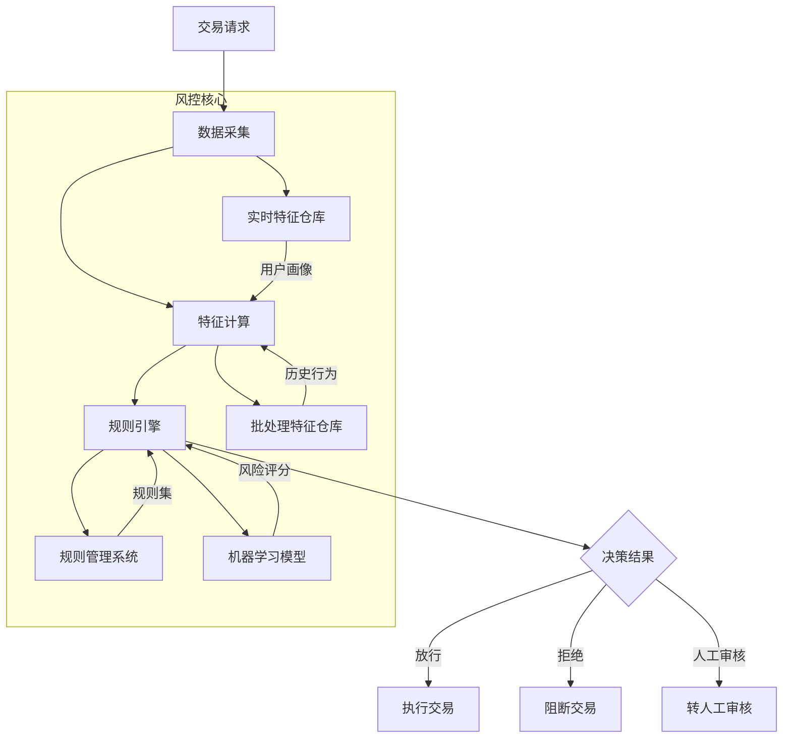
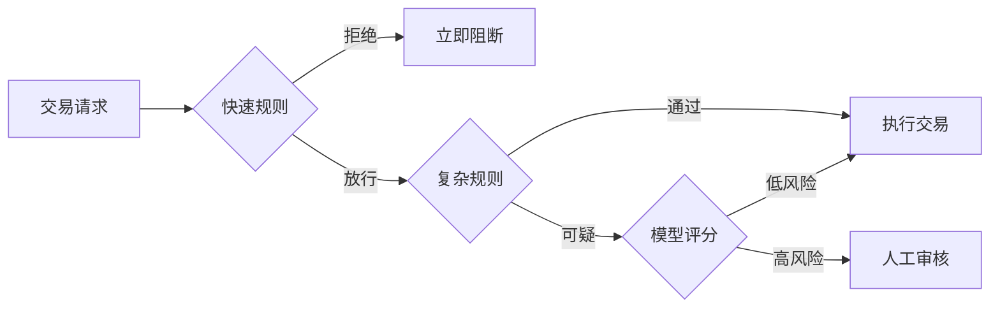
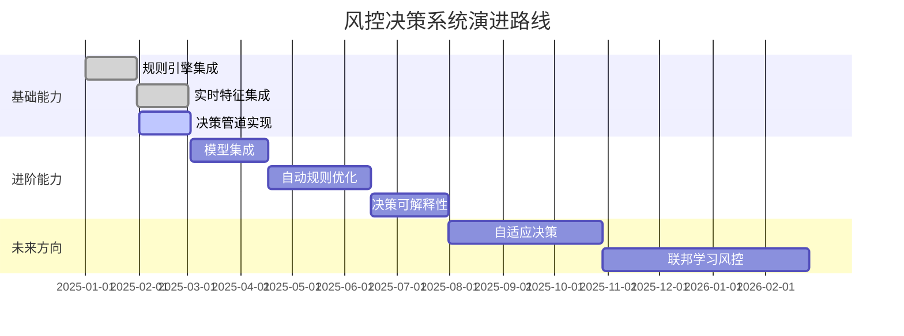

# 风控引擎交易请求决策流程设计与实现

## 一、决策流程架构设计



## 二、决策流程核心实现

### 1. 决策服务入口

```java
@RestController
@RequestMapping("/risk")
public class RiskController {

    @Autowired
    private RiskDecisionService riskDecisionService;

    @PostMapping("/decision")
    public RiskDecisionResponse makeDecision(@RequestBody TransactionRequest request) {
        return riskDecisionService.evaluate(request);
    }
}
```

### 2. 决策服务核心实现

```java
@Service
public class RiskDecisionServiceImpl implements RiskDecisionService {

    @Autowired
    private FeatureService featureService;
    
    @Autowired
    private RuleEngine ruleEngine;
    
    @Autowired
    private ModelService modelService;

    @Override
    public RiskDecisionResponse evaluate(TransactionRequest request) {
        // 1. 获取用户特征
        Map<String, Object> features = featureService.getUserFeatures(
            request.getUserId(),
            Arrays.asList(
                "7d_trans_cnt", 
                "1h_fail_cnt",
                "device_risk_score",
                "ip_region_risk"
            )
        );
        
        // 2. 构建决策上下文
        RiskContext context = new RiskContext(request, features);
        
        // 3. 执行规则引擎决策
        RuleResult ruleResult = ruleEngine.execute(context);
        
        // 4. 机器学习模型评分
        if (ruleResult.getAction() == RiskAction.REVIEW) {
            double modelScore = modelService.predict(context);
            context.setModelScore(modelScore);
            
            // 根据模型分数调整决策
            if (modelScore > 0.85) {
                ruleResult.setAction(RiskAction.REJECT);
            } else if (modelScore < 0.2) {
                ruleResult.setAction(RiskAction.ACCEPT);
            }
        }
        
        // 5. 生成决策响应
        return buildResponse(ruleResult, context);
    }
    
    private RiskDecisionResponse buildResponse(RuleResult ruleResult, RiskContext context) {
        RiskDecisionResponse response = new RiskDecisionResponse();
        response.setAction(ruleResult.getAction());
        response.setRequestId(context.getRequestId());
        response.setUserId(context.getUserId());
        response.setTriggeredRules(ruleResult.getTriggeredRules());
        response.setModelScore(context.getModelScore());
        
        // 添加风控建议
        if (response.getAction() == RiskAction.REVIEW) {
            response.setSuggestion("请提供交易凭证进行人工审核");
        } else if (response.getAction() == RiskAction.REJECT) {
            response.setSuggestion("该交易存在高风险，请联系客服");
        }
        
        return response;
    }
}
```

### 3. 规则引擎实现（Drools集成）

```java
@Component
public class DroolsRuleEngine implements RuleEngine {
    
    private KieContainer kieContainer;
    
    @PostConstruct
    public void init() {
        KieServices ks = KieServices.Factory.get();
        kieContainer = ks.getKieClasspathContainer();
    }

    @Override
    public RuleResult execute(RiskContext context) {
        KieSession kieSession = kieContainer.newKieSession("riskSession");
        RuleResult result = new RuleResult();
        
        kieSession.setGlobal("result", result);
        kieSession.insert(context);
        kieSession.fireAllRules();
        kieSession.dispose();
        
        return result;
    }
}
```

## 三、决策规则设计（Drools DRL示例）

### 1. 基础规则：大额交易验证

```drools
rule "Large Amount Check"
    salience 10  // 高优先级
    when
        context : RiskContext(
            amount > 50000, 
            userLevel < 3
        )
    then
        result.setAction(RiskAction.REVIEW);
        result.addTriggeredRule("Large_Amount_Check");
        System.out.println("触发大额交易验证规则");
end
```

### 2. 设备风险规则

```drools
rule "High Risk Device"
    salience 20
    when
        context : RiskContext(
            features["device_risk_score"] > 0.8
        )
    then
        result.setAction(RiskAction.REJECT);
        result.addTriggeredRule("High_Risk_Device");
        System.out.println("触发高风险设备规则");
end
```

### 3. 高频失败规则

```drools
rule "High Frequency Failure"
    when
        context : RiskContext(
            features["1h_fail_cnt"] > 5
        )
    then
        result.setAction(RiskAction.REJECT);
        result.addTriggeredRule("High_Freq_Failure");
        System.out.println("触发高频失败规则");
end
```

### 4. IP异常规则

```drools
rule "IP Location Mismatch"
    when
        context : RiskContext(
            ipRegion != userRegion, 
            features["ip_region_risk"] > 0.7
        )
    then
        result.setAction(RiskAction.REVIEW);
        result.addTriggeredRule("IP_Location_Mismatch");
        System.out.println("触发IP位置不匹配规则");
end
```

## 四、决策流程优化策略

### 1. 多阶段决策流程



### 2. 规则执行优化

```java
// 规则分组执行
public RuleResult execute(RiskContext context) {
    // 第一阶段：执行快速规则
    RuleResult fastResult = executeRuleGroup("fast-rules", context);
    if (fastResult.getAction() != RiskAction.ACCEPT) {
        return fastResult;
    }
    
    // 第二阶段：执行复杂规则
    return executeRuleGroup("complex-rules", context);
}

private RuleResult executeRuleGroup(String group, RiskContext context) {
    KieSession kieSession = kieContainer.newKieSession("riskSession");
    kieSession.getAgenda().getAgendaGroup(group).setFocus();
    
    RuleResult result = new RuleResult();
    kieSession.setGlobal("result", result);
    kieSession.insert(context);
    
    kieSession.fireAllRules();
    kieSession.dispose();
    
    return result;
}
```

### 3. 动态规则加载

```java
@Scheduled(fixedRate = 30000) // 每30秒检查规则更新
public void reloadRules() {
    List<Rule> updatedRules = ruleService.getActiveRules();
    if (!updatedRules.isEmpty()) {
        KieServices ks = KieServices.Factory.get();
        KieFileSystem kfs = ks.newKieFileSystem();
        
        // 生成DRL文件
        String drlContent = generateDrl(updatedRules);
        kfs.write("src/main/resources/rules.drl", 
            ks.getResources().newByteArrayResource(drlContent.getBytes()));
        
        // 构建新容器
        KieBuilder kieBuilder = ks.newKieBuilder(kfs).buildAll();
        KieModule kieModule = kieBuilder.getKieModule();
        kieContainer = ks.newKieContainer(kieModule.getReleaseId());
    }
}
```

## 五、决策结果处理策略

### 1. 决策结果处理管道

```java
public interface DecisionHandler {
    void handle(RiskDecisionResponse response);
}

@Component
public class DecisionHandlerPipeline {
    
    @Autowired
    private List<DecisionHandler> handlers;
    
    public void process(RiskDecisionResponse response) {
        for (DecisionHandler handler : handlers) {
            handler.handle(response);
        }
    }
}

// 示例处理器
@Component
public class NotificationHandler implements DecisionHandler {
    @Override
    public void handle(RiskDecisionResponse response) {
        if (response.getAction() == RiskAction.REVIEW) {
            sendSms(response.getUserId(), "您的交易需要人工审核");
        } else if (response.getAction() == RiskAction.REJECT) {
            sendSms(response.getUserId(), "交易被拒绝，请联系客服");
        }
    }
}

@Component
public class AuditLogHandler implements DecisionHandler {
    @Override
    public void handle(RiskDecisionResponse response) {
        auditRepository.save(buildAuditRecord(response));
    }
}
```

### 2. 人工审核集成

```java
@Service
public class ManualReviewService {

    @Autowired
    private TaskAssigner taskAssigner;
    
    @Autowired
    private ReviewTaskRepository taskRepository;
    
    public ReviewTask createReviewTask(RiskDecisionResponse response) {
        ReviewTask task = new ReviewTask();
        task.setRequestId(response.getRequestId());
        task.setUserId(response.getUserId());
        task.setPriority(calculatePriority(response));
        task.setAssignedTo(taskAssigner.assignReviewer());
        
        return taskRepository.save(task);
    }
    
    private int calculatePriority(RiskDecisionResponse response) {
        double riskScore = response.getModelScore();
        if (riskScore > 0.8) return 1; // 最高优先级
        if (riskScore > 0.6) return 2;
        return 3; // 普通优先级
    }
}
```

## 六、生产环境最佳实践

### 1. 决策监控看板

```java
@Aspect
@Component
public class DecisionMonitor {
    
    private final MeterRegistry meterRegistry;
    
    public DecisionMonitor(MeterRegistry meterRegistry) {
        this.meterRegistry = meterRegistry;
    }
    
    @AfterReturning(
        pointcut = "execution(* com.example.risk.RiskDecisionService.evaluate(..))", 
        returning = "response")
    public void recordDecision(RiskDecisionResponse response) {
        // 记录决策结果分布
        meterRegistry.counter("risk.decision.action", 
            "action", response.getAction().name()).increment();
        
        // 记录规则触发情况
        response.getTriggeredRules().forEach(rule -> 
            meterRegistry.counter("risk.rule.trigger", "rule", rule).increment());
        
        // 记录决策延迟
        long latency = System.currentTimeMillis() - response.getRequestTimestamp();
        meterRegistry.timer("risk.decision.latency").record(latency, TimeUnit.MILLISECONDS);
    }
}
```

### 2. 灰度发布策略

```yaml
# application-risk.yml
risk:
  release:
    strategy: canary
    rules:
      - group: "v2-rules"
        percentage: 10
        conditions:
          - userId % 10 < 1  # 10%用户流量
      - group: "v3-model"
        percentage: 5
        conditions:
          - region in ["US", "UK"]
```

### 3. 决策回放机制

```java
public class DecisionReplayer {
    
    public void replayDecisions(LocalDate date) {
        List<TransactionRequest> requests = requestRepository.findByDate(date);
        
        requests.forEach(request -> {
            // 使用当前规则重新决策
            RiskDecisionResponse response = riskDecisionService.evaluate(request);
            
            // 与原始决策比较
            RiskDecisionResponse original = originalDecisionRepository.find(request.getId());
            
            if (!response.getAction().equals(original.getAction())) {
                log.warn("Decision changed for request {}: {} -> {}", 
                    request.getId(), original.getAction(), response.getAction());
                // 触发规则更新通知
            }
        });
    }
}
```

## 七、决策流程演进路线



## 总结

风控引擎交易决策的核心要素：

1. **分层决策架构**：
   - 快速规则层：毫秒级高风险拦截
   - 复杂规则层：多维度风险评估
   - 模型层：机器学习精准评分

2. **关键优化点**：
   - 规则分组与优先级管理
   - 动态规则热更新
   - 多级决策结果处理
   - 人工审核无缝集成

3. **生产级保障**：
   - 决策全链路监控
   - 灰度发布机制
   - 决策回放验证
   - 可解释性分析

4. **演进方向**：
   - 实时自适应规则
   - 深度模型集成
   - 决策可解释性增强
   - 联邦学习风控

通过上述设计，风控引擎能够实现毫秒级交易决策，平衡安全性与用户体验，同时保持系统的灵活性和可扩展性。实际应用中需根据业务特点调整规则权重和模型参数，并持续优化决策流程。